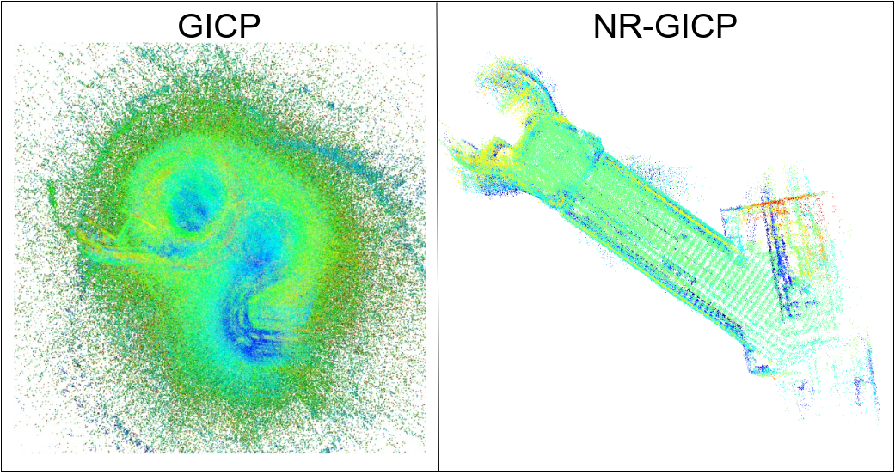
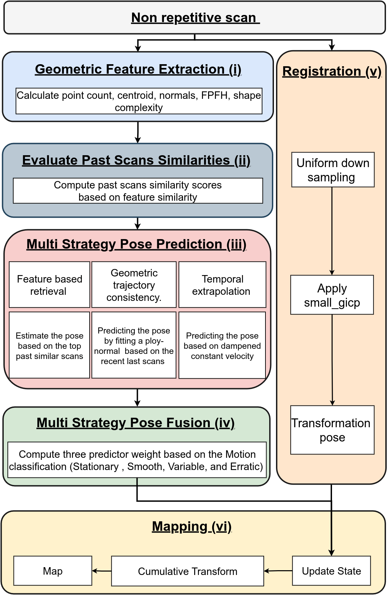

# Non-Repetitive Scan Correction for LiDAR Odometry via Spatial Analysis in CERN Facilities

## 🚀 Overview

This repository implements a novel **LiDAR odometry and mapping pipeline** optimized for **non-repetitive LiDAR scans**, validated across real-world environments at **CERN**.

Unlike conventional LiDAR systems with repetitive scanning patterns, modern sensors like the Unitree UniLiDAR L1 introduce sparse, irregular data—causing traditional SLAM systems to fail.

This project introduces a **spatial-context-aware registration framework** with:
- Geometric feature encoding
- Multi-strategy motion prediction
- Adaptive pose fusion
- Robustness to minimal scan overlap and distorted motion

👉 [📄 IEEE Access Paper](https://doi.org/10.1109/ACCESS.2024.0429000)  
👉 [🔗 GitHub Code](https://github.com/Pejman712/NonRep.git)

---

## 📍 Motivation

> “Conventional registration methods break down with sparse, non-overlapping scans. This work tackles the failure modes of modern LiDAR in underground or structured environments.”
---

## 🧠 Key Contributions

✅ Real-time capable LiDAR odometry for non-repetitive scan patterns  
✅ Adaptive fusion of predicted poses with observed transformations  
✅ Tested across 6 distinct CERN environments  
✅ Robust to motion distortion, minimal overlap, and structural ambiguity  
✅ Benchmark datasets available for public evaluation  

---

## 🧰 Method Overview

The method combines:
- **Comprehensive feature extraction** (FPFH, PCA, normals)
- **Pose prediction** (similarity matching, trajectory modeling, extrapolation)
- **Adaptive motion classification** (stationary, erratic, variable, smooth)
- **Fallback-aware GICP integration** with confidence checking

---

## 📊 Performance Evaluation

### 🔍 Quantitative & Visual Results

We tested our method in 6 real-world CERN environments, including:
- Tunnels (BA6, BA5)
- Object-rich labs (CHARM)
- Symmetrical domes (Dumparea)

---

## 🗺️ Reconstructed Maps

Each map below showcases high-fidelity 3D reconstruction, sharper geometry, and better alignment using our proposed method.

---

## 📂 Datasets & Structure

- 📁 `testdata/`: Benchmark point cloud datasets from CERN  
- 📁 `Figures/`: Visuals used in the paper and documentation  
- 📁 `nonrep/`: Core registration and SLAM pipeline code
---

